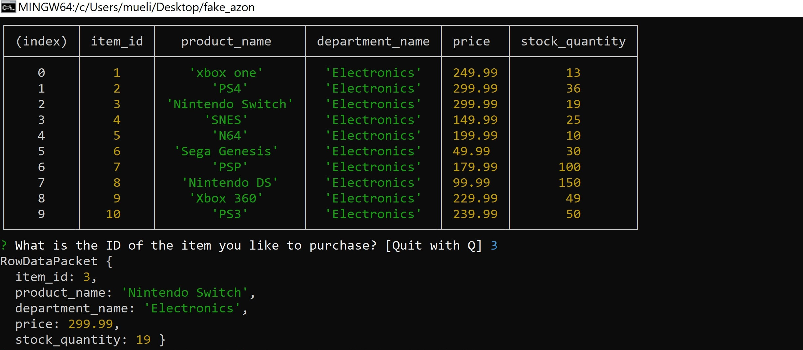

# fake_azon
MYSQL and NODE app, simulating a store

HOW IT WORKS!!

1.Costumer will be shown an up to date table of items available in stock and then prompted with the question "What is the ID of the item you like to purchase?"

2.Costumer then will input the ID number of desired item, in this case 3(Nintendo Switch)
then a small description of the item(name,department and price) will be given and followed with a prompt
asking the costumer how many, of that items they will like to purchase.

3.We will "purchase" 15 in this case, it will confirm the purchase and then update the current stock into our database automatically.

